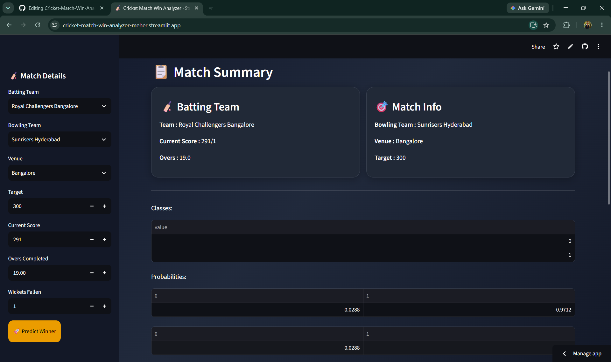
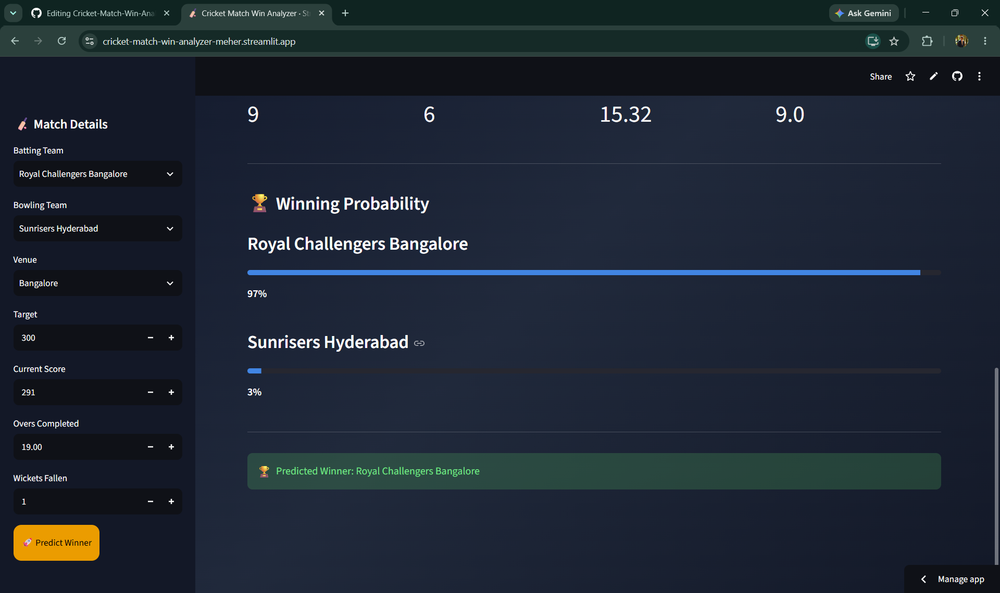

# 🏏 Cricket Match Win Analyzer (IPL)

An interactive Machine Learning based Streamlit web application that predicts the winning probability of IPL teams during live matches.

## 🚀 Live Demo

https://cricket-match-win-analyzer-meher.streamlit.app

## 📂 GitHub Repository

https://github.com/Meherchandrakanth/Cricket-Match-Win-Analyzer-IPL

## ✨ Features

- Live IPL Win Probability Prediction
- Machine Learning based Prediction
- Modern Streamlit UI
- Real-time Match Analysis

## 🛠 Technologies Used

- Python
- Pandas
- NumPy
- Scikit-learn
- Streamlit

## 📊 Dataset

- IPL Matches Dataset
- IPL Deliveries Dataset

## ▶️ How to Run

```bash
pip install -r requirements.txt
streamlit run app.py
```
## 📁 Project Structure

```
Cricket-Match-Win-Analyzer-IPL/
│── app.py
│── model.ipynb
│── pipe.pkl
│── requirements.txt
│── README.md
│── data/
└── homepage-images/
```
## 📸 Application Preview

### Home Page


### Prediction Result

